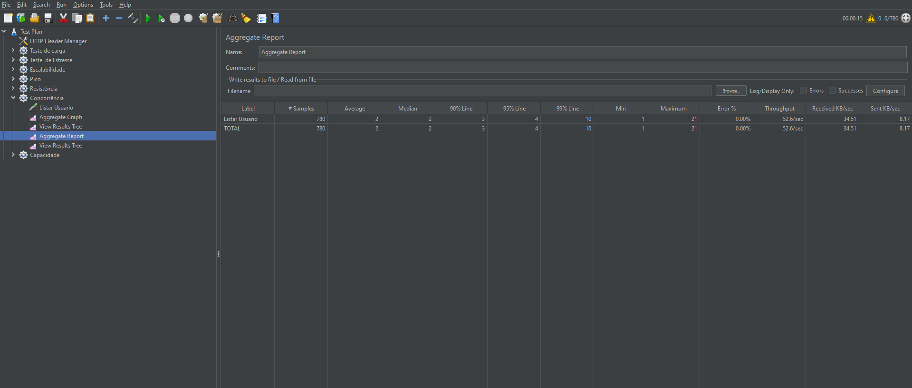

## Teste de performance /Usuários

### TP01 Teste de carga

- Number of threads(users): 800

- Ramp-up period (seconds): 20s

- tempo: 2 min

### TP02 Teste de pico

- Number of threads(users): 800

- Ramp-up period (seconds): 2s

- tempo: 2 min

### TP03 Teste de estresse

- Number of threads(users):900

- Ramp-up period (seconds):20s

- tempo: 2 min

### TP04 Teste de escalabilidade

- Number of threads(users):960

- Ramp-up period (seconds):20s

- tempo: 2 min

### TP05 Teste de Concorrência

- Number of threads(users):780

- Ramp-up period (seconds): 15s

- tempo: 2 min

### TP06 Teste de Capacidade

- Number of threads(users): 700

- Ramp-up period (seconds):10s

- tempo: 2 min

### Hardwere usado para os testes

- Sistema Operacional: Windows 10 x64
- Programa: Jmeter