## Resultados dos testes 

## /Usuarios

_1 - CAPACITY post usuários_

```
capacityThresholds: {
 stages: [
    { duration: '2m', target: 150 },
    { duration: '3m', target: 150 },
    { duration: '2m', target: 0 },
    ],
    thresholds: {
        http_req_duration: ['p(95)<2000'],
        http_req_failed: ['rate<0.1']
        }
```


_2 - ENDURANCE POST USUARIOS_

```
enduranceThresholds:{
            stages: [
                { duration: '3m', target: 150},
                { duration: '4m', target: 150},
                { duration: '2m', target: 0},
            ],
            thresholds: {
                http_req_duration: ['p(95)<2000'],
                http_req_failed: ['rate<0.1']
            }
```
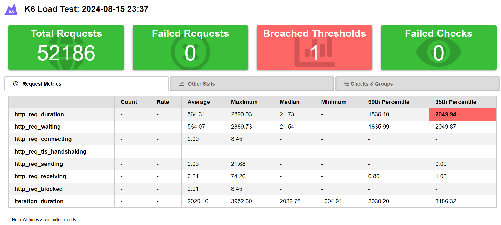

_3 - LOAD GET USUARIOS_
```
loadThresholds:{
            vus: 150, 
            duration: '20s',
            thresholds: {
                http_req_duration: ['p(95)<6000'],
                http_req_failed: ['rate<0.1']
            }
```

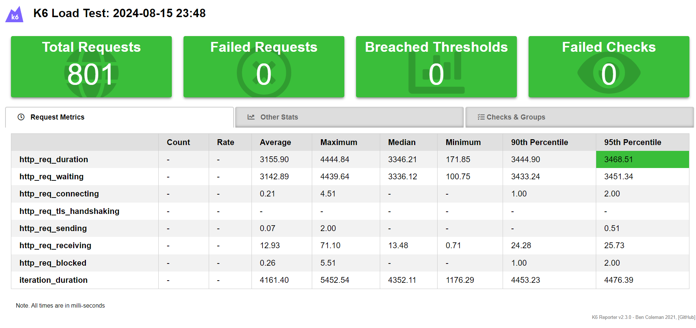


_4 - SPIKE POST USUARIOS_
```
spikeThresholds:{
            stages: [
                { duration: '30s', target: 500 }, // fast ramp-up to a high point
                // No plateau
                { duration: '15s', target: 0 }, // quick ramp-down to 0 users
              ],
            thresholds: {
                http_req_duration: ['p(95)<5000'],
                http_req_failed: ['rate<0.1']
            }
```


_5 - STRESS GET USUARIOS
```
stressThresholds:{
            stages: [
                { duration: '3m', target: 200 }, // traffic ramp-up from 1 to a higher 200 users over 10 minutes.
                { duration: '5m', target: 200 }, // stay at higher 200 users for 30 minutes
                { duration: '1m', target: 0 }, // ramp-down to 0 users
              ],
            thresholds: {
                http_req_duration: ['p(95)<4000'],
                http_req_failed: ['rate<0.1']
            }
```

## /Produtos

_1 - CAPACITY POST PRODUTOS_
```
capacityThresholds: {
            stages: [
                { duration: '2m', target: 150 },
                { duration: '3m', target: 150 },
                { duration: '2m', target: 0 },
            ],
            thresholds: {
                http_req_duration: ['p(95)<2000'],
                http_req_failed: ['rate<0.1']
            }
```

_2 - endurance post produtos_
```
enduranceThresholds:{
            stages: [
                { duration: '1m', target: 100},
                { duration: '2m', target: 100},
                { duration: '30s', target: 0},
            ],
            thresholds: {
                http_req_duration: ['p(95)<2000'],
                http_req_failed: ['rate<0.1']
            }
```
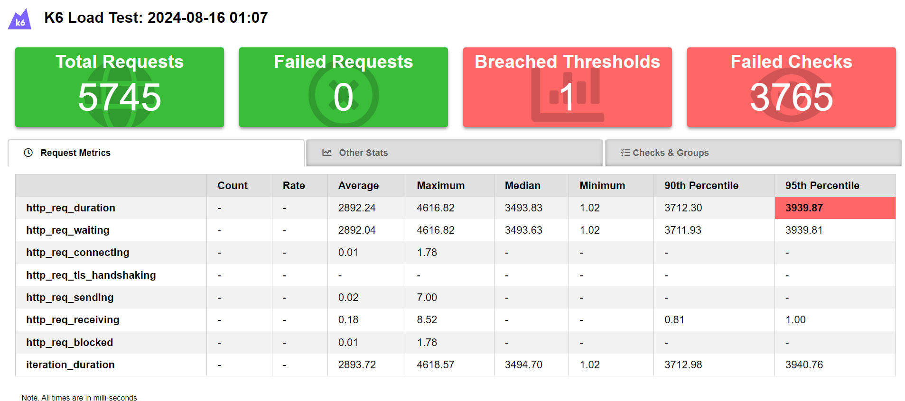


_3 - load Post produtos_
```
loadThresholds:{
            vus: 150, 
            duration: '20s',
            thresholds: {
                http_req_duration: ['p(95)<6000'],
                http_req_failed: ['rate<0.1']
            }
```
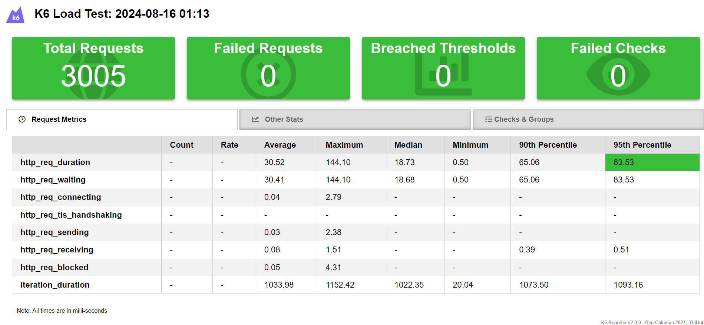

_4 - spike post produtos_
```
spikeThresholds:{
            stages: [
                { duration: '30s', target: 500 }, // fast ramp-up to a high point
                // No plateau
                { duration: '15s', target: 0 }, // quick ramp-down to 0 users
              ],
            thresholds: {
                http_req_duration: ['p(95)<5000'],
                http_req_failed: ['rate<0.1']
            }
```
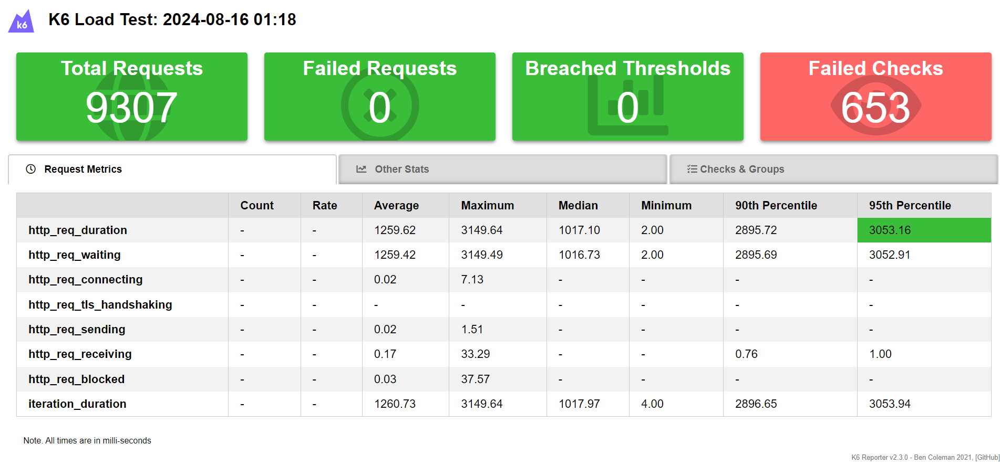

_5 - stress GET PRODUTOS_
```
stressThresholds:{
            stages: [
                { duration: '3m', target: 200 }, // traffic ramp-up from 1 to a higher 200 users over 10 minutes.
                { duration: '5m', target: 200 }, // stay at higher 200 users for 30 minutes
                { duration: '1m', target: 0 }, // ramp-down to 0 users
              ],
            thresholds: {
                http_req_duration: ['p(95)<4000'],
                http_req_failed: ['rate<0.1']
            }
```
(um pequeno equivoco no código onde era pra ser status 200 e não 201)

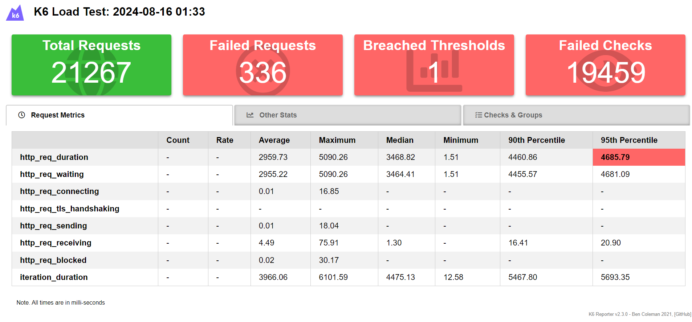

## /Login

_1 - capacity Login_
```
capacityThresholds: {
            stages: [
                { duration: '2m', target: 150 },
                { duration: '3m', target: 150 },
                { duration: '2m', target: 0 },
            ],
            thresholds: {
                http_req_duration: ['p(95)<2000'],
                http_req_failed: ['rate<0.1']
            }
```
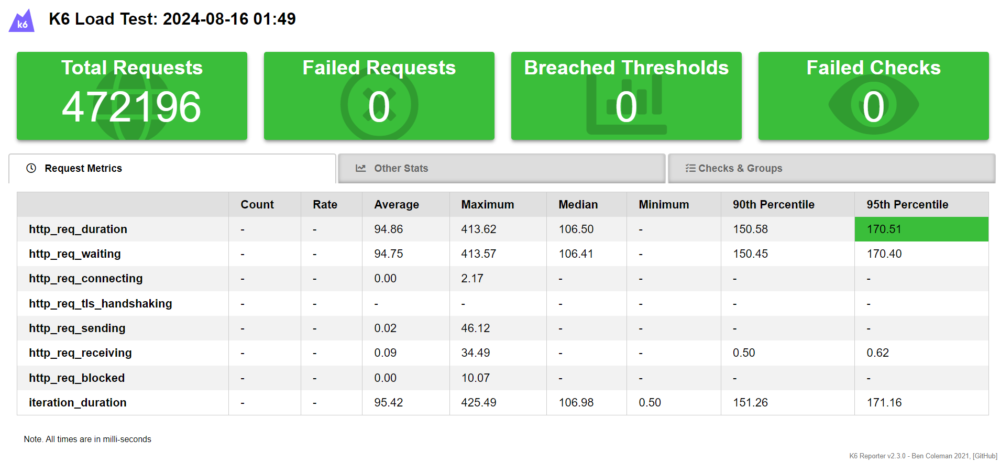

_2 - endurance Login_
```
enduranceThresholds:{
            stages: [
                { duration: '1m', target: 100},
                { duration: '2m', target: 100},
                { duration: '30s', target: 0},
            ],
            thresholds: {
                http_req_duration: ['p(95)<2000'],
                http_req_failed: ['rate<0.1']
            }
```
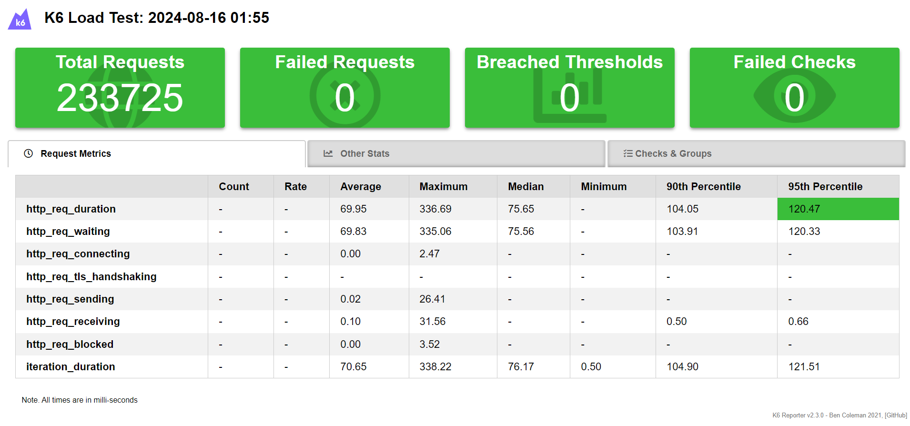

_3 - load Login_
```
loadThresholds:{
            vus: 150, 
            duration: '20s',
            thresholds: {
                http_req_duration: ['p(95)<6000'],
                http_req_failed: ['rate<0.1']
            }
```
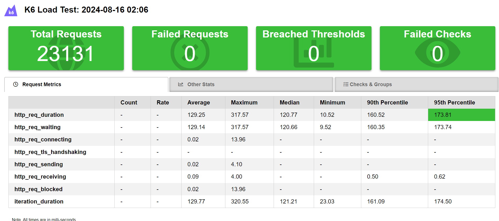

_4 - spike login_
```
spikeThresholds:{
            stages: [
                { duration: '30s', target: 500 }, // fast ramp-up to a high point
                // No plateau
                { duration: '15s', target: 0 }, // quick ramp-down to 0 users
              ],
            thresholds: {
                http_req_duration: ['p(95)<5000'],
                http_req_failed: ['rate<0.1']
            }
```
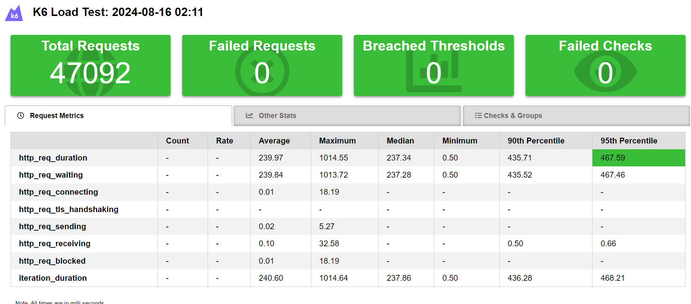

_5 - stress login_
```
stressThresholds:{
            stages: [
                { duration: '3m', target: 200 }, // traffic ramp-up from 1 to a higher 200 users over 10 minutes.
                { duration: '5m', target: 200 }, // stay at higher 200 users for 30 minutes
                { duration: '1m', target: 0 }, // ramp-down to 0 users
              ],
            thresholds: {
                http_req_duration: ['p(95)<4000'],
                http_req_failed: ['rate<0.1']
            }
```
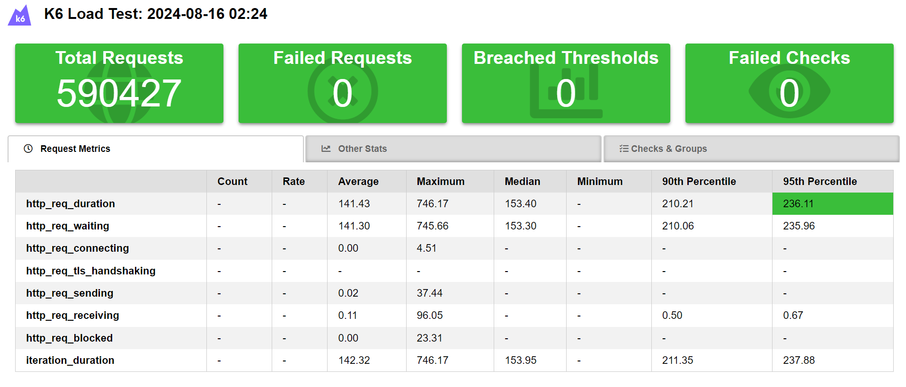

## /Carrinhos

_1 - capacity Get ID carrinhos_
```
capacityThresholds: {
            stages: [
                { duration: '2m', target: 150 },
                { duration: '3m', target: 150 },
                { duration: '2m', target: 0 },
            ],
            thresholds: {
                http_req_duration: ['p(95)<2000'],
                http_req_failed: ['rate<0.1']
            }
```
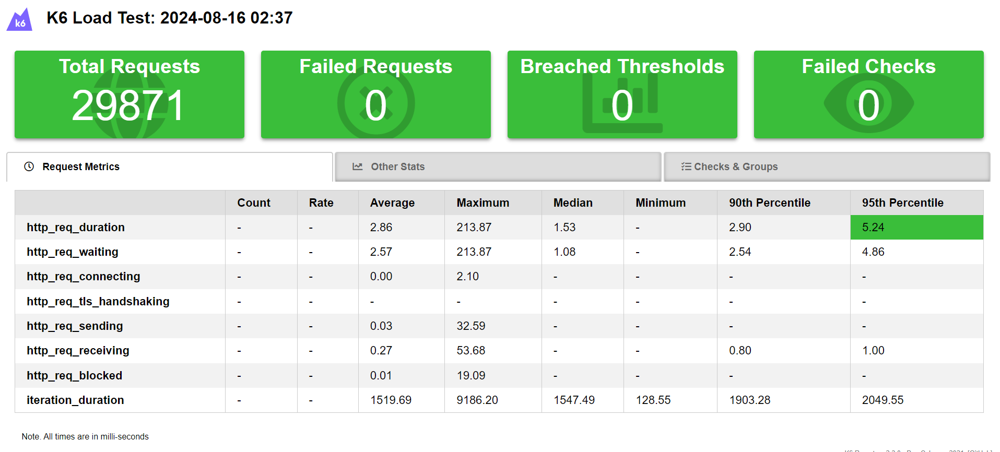

_2 - endurance Get ID Carrinhos_
```
enduranceThresholds:{
            stages: [
                { duration: '1m', target: 100},
                { duration: '2m', target: 100},
                { duration: '30s', target: 0},
            ],
            thresholds: {
                http_req_duration: ['p(95)<2000'],
                http_req_failed: ['rate<0.1']
            }
```
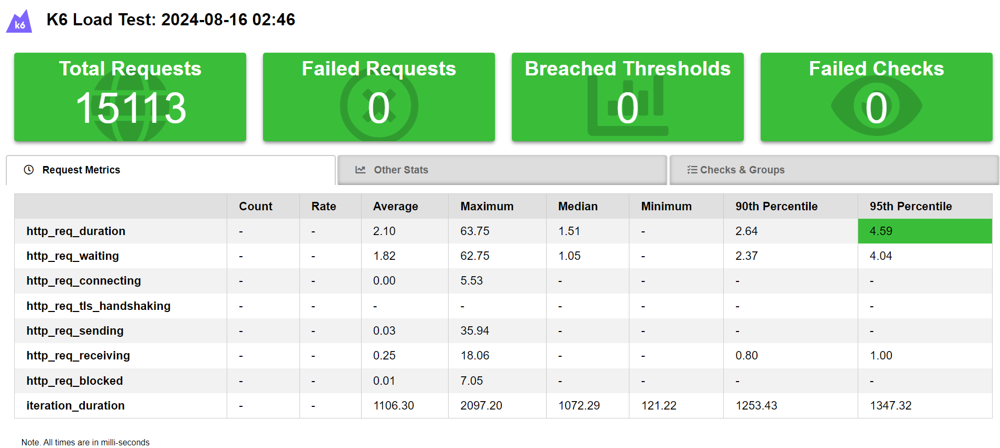

_3 - load GET Carrinhos_
```
loadThresholds:{
            vus: 150, 
            duration: '20s',
            thresholds: {
                http_req_duration: ['p(95)<6000'],
                http_req_failed: ['rate<0.1']
            }
```
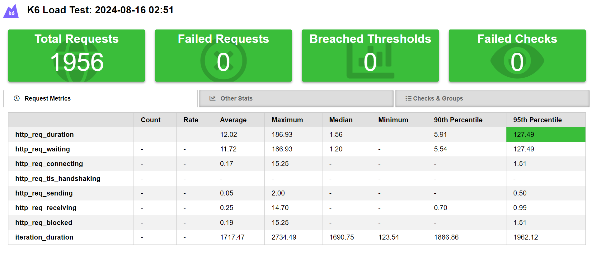

_4 - spike GET Carrinhos_
```
spikeThresholds:{
            stages: [
                { duration: '30s', target: 500 }, // fast ramp-up to a high point
                // No plateau
                { duration: '15s', target: 0 }, // quick ramp-down to 0 users
              ],
            thresholds: {
                http_req_duration: ['p(95)<5000'],
                http_req_failed: ['rate<0.1']
            }
```

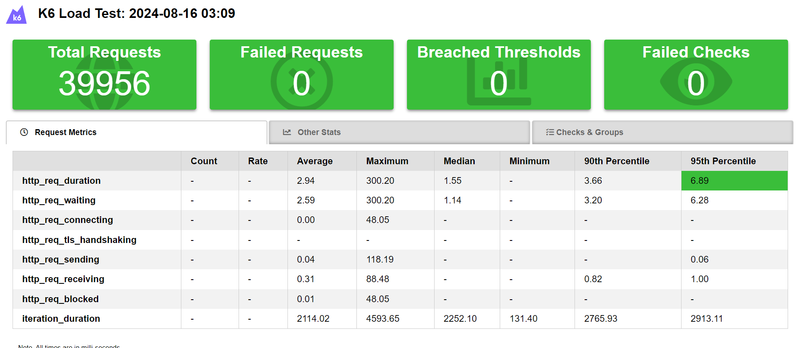

_5 - stress GET carrinhos_
```
stressThresholds:{
            stages: [
                { duration: '3m', target: 200 }, // traffic ramp-up from 1 to a higher 200 users over 10 minutes.
                { duration: '5m', target: 200 }, // stay at higher 200 users for 30 minutes
                { duration: '1m', target: 0 }, // ramp-down to 0 users
              ],
            thresholds: {
                http_req_duration: ['p(95)<4000'],
                http_req_failed: ['rate<0.1']
            }
```


## Fluxos de testes

# primeiro fluxo:

- Cria usuario
- Faz login
- Adiciona produto ao carrinho
- Exclui produto e carrinho

_FLUXO COM LOAD TEST_
```
loadThresholds:{
            vus: 150, 
            duration: '20s',
            thresholds: {
                http_req_duration: ['p(95)<6000'],
                http_req_failed: ['rate<0.1']
            }
```
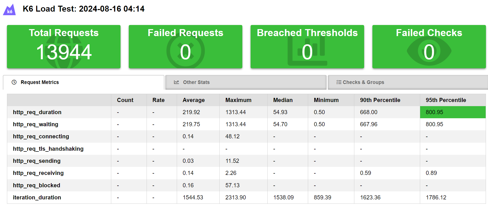


## Resumo:

No geral, os testes foram como o esperado, com o foco em tempo de performance, se saíram bem abaixo dos 9 minutos de testes em endurance e capacity. Acima disso começava a dar erro por conta dos tokens que expiravam.


## Máquina usada para os testes:

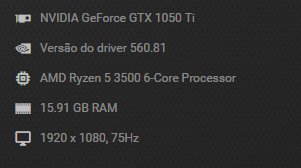

- Sistema operacional: Windows 11 x64
- IDE usada para os testes: VsCode