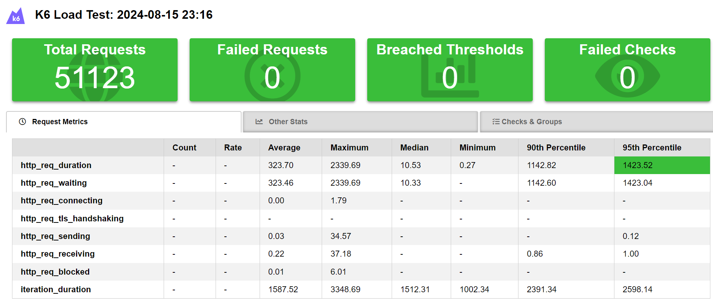

## Resultados dos testes 

### /Usuarios

1 - CAPACITY post usuários

``capacityThresholds: {
            stages: [
                { duration: '2m', target: 150 },
                { duration: '3m', target: 150 },
                { duration: '2m', target: 0 },
            ],
            thresholds: {
                http_req_duration: ['p(95)<2000'],
                http_req_failed: ['rate<0.1']
            }``

