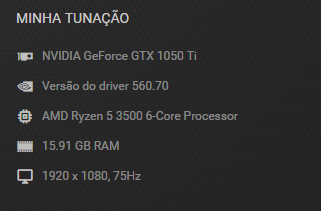

### Máquina usada para efetuar os testes

## Rota /usuarios

| ID do Caso de Teste | Descrição | Critério de Aceitação | Passos | Resultado Esperado | Tipo de Teste de Desempenho |
|---------------------|-----------|-----------------------|--------|---------------------|------------------------------|
| CT-001 | Teste de Carga para Registro de Usuário | Tempo de resposta deve ser inferior a 7 segundos para 310 usuários simultâneos | 1. Simular 310 usuários enviando requisições GET para /usuarios. | Todos os usuários são registrados com sucesso. | Teste de Carga |
| CT-002 | Teste de Estresse para Registro de Usuário | Sistema deve suportar 50 usuários simultâneos sem falhas críticas | 1. Simular 200 usuários enviando requisições GET para /usuarios. | Sistema permanece estável. | Teste de Estresse |
| CT-003 | Teste de Escalabilidade para Registro de Usuário | Sistema deve manter desempenho aceitável com aumento progressivo de carga | 1. Aumentar gradualmente o número de usuários enviando requisições GET para /usuarios até 80 usuários. | Sistema mantém bom desempenho. | Teste de Escalabilidade |
| CT-004 | Teste de Pico para Registro de Usuário | Sistema deve lidar com rajadas súbitas de 400 usuários em 5 segundos | 1. Simular 400 usuários enviando requisições GET para /usuarios em 5 segundos. | Sistema permanece estável. | Teste de Pico |
| CT-005 | Teste de Resistência para Registro de Usuário | Sistema deve permanecer estável após 5 minutos de carga contínua | 1. Simular 210 usuários enviando requisições GET para /usuarios continuamente por 5 minutos. | Sistema permanece estável. | Teste de Resistência |

## Rota /login

| ID do Caso de Teste | Descrição | Critério de Aceitação | Passos | Resultado Esperado | Tipo de Teste de Desempenho |
|---------------------|-----------|-----------------------|--------|---------------------|------------------------------|
| CT-008 | Teste de Carga para Login | Tempo de resposta deve ser inferior a 2 segundos para 3000 usuários simultâneos | 1. Simular 3000 usuários enviando requisições POST para /login. | Todos os usuários são autenticados com sucesso. | Teste de Carga |
| CT-009 | Teste de Estresse para Login | Sistema deve suportar 6000 usuários simultâneos sem falhas críticas | 1. Simular 6000 usuários enviando requisições POST para /login. | Sistema permanece estável. | Teste de Estresse |
| CT-010 | Teste de Escalabilidade para Login | Sistema deve manter desempenho aceitável com aumento progressivo de carga | 1. Aumentar gradualmente o número de usuários enviando requisições POST para /login até 3000 usuários. | Sistema mantém bom desempenho. | Teste de Escalabilidade |
| CT-011 | Teste de Pico para Login | Sistema deve lidar com rajadas súbitas de 4500 usuários em 2 minutos | 1. Simular 4500 usuários enviando requisições POST para /login em 2 minutos. | Sistema permanece estável. | Teste de Pico |
| CT-012 | Teste de Resistência para Login | Sistema deve permanecer estável após 60 minutos de carga contínua | 1. Simular 3000 usuários enviando requisições POST para /login continuamente por 60 minutos. | Sistema permanece estável. | Teste de Resistência |

## Rota /produtos

| ID do Caso de Teste | Descrição | Critério de Aceitação | Passos | Resultado Esperado | Tipo de Teste de Desempenho |
|---------------------|-----------|-----------------------|--------|---------------------|------------------------------|
| CT-015 | Teste de Carga para Cadastro de Produto | Tempo de resposta deve ser inferior a 2 segundos para 3000 usuários simultâneos | 1. Simular 3000 usuários enviando requisições POST para /produtos. | Todos os produtos são cadastrados com sucesso. | Teste de Carga |
| CT-016 | Teste de Estresse para Cadastro de Produto | Sistema deve suportar 6000 usuários simultâneos sem falhas críticas | 1. Simular 6000 usuários enviando requisições POST para /produtos. | Sistema permanece estável. | Teste de Estresse |
| CT-017 | Teste de Escalabilidade para Cadastro de Produto | Sistema deve manter desempenho aceitável com aumento progressivo de carga | 1. Aumentar gradualmente o número de usuários enviando requisições POST para /produtos até 3000 usuários. | Sistema mantém bom desempenho. | Teste de Escalabilidade |
| CT-018 | Teste de Pico para Cadastro de Produto | Sistema deve lidar com rajadas súbitas de 4500 usuários em 2 minutos | 1. Simular 4500 usuários enviando requisições POST para /produtos em 2 minutos. | Sistema permanece estável. | Teste de Pico |
| CT-019 | Teste de Resistência para Cadastro de Produto | Sistema deve permanecer estável após 60 minutos de carga contínua | 1. Simular 3000 usuários enviando requisições POST para /produtos continuamente por 60 minutos. | Sistema permanece estável. | Teste de Resistência |
