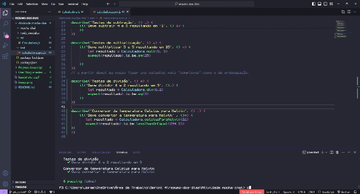

# Sprint 4

## Navegando no JS e testes exploratórios ⛵

- Testes Exploratórios
- Linguagem de programação Javascript.
- ​​​​​​​TDD - Test Driven Development ou Desenvolvimento Guiado por Testes
- Bibliotecas como Mocha e Chai.

### Nessa sprint aprendemos um pouco sobre o Javascript, TDD com Mocha e Chai.

## [Projetos com atividades em JavaScript](./Projetos%20Javascript/)

## **Alguns desses projetos foi de fazer uma calculadora, pode ser acessado por aqui ➡** [🧮](./Atividade%20mocha-chai/src/Calculadora.js)

Para executa-la voce precisará:

- Instalar o VsCode (ou qualquer outra IDE de sua preferencia)
- instalar o Mocha e Chai
para a instalação, voce pode encontra-los aqui: https://mochajs.org/ e https://www.chaijs.com/
- Rodar atravez do terminal aplicando o comando _npm test_

_Agradecimento especial a Leticia Ribeiro pela dica do gif_ 👍

## Rota _/Carrinhos_ e sua parte no mapa mental:

**Voce pode conferir o mapa mental completo, a user story e os testes [aqui!](./User%20Story%20e%20testes%20%20Carrinhos/image.png)**

### Agradecimento aos que contribuíram com este projeto:

- Letícia Ribeiro
- Daniel Pontes
- Enzo Rossi
- Mathias
- Oliver

_Cada ideia compartilhada contribuiu para o sucesso do nosso trabalho em equipe. Agradeço por estarem sempre dispostos a esclarecer dúvidas, resolver problemas e trabalhar juntos para atingir nossos objetivos.
Vocês são incríveis! Vamos continuar construindo coisas incríveis juntos._ 

