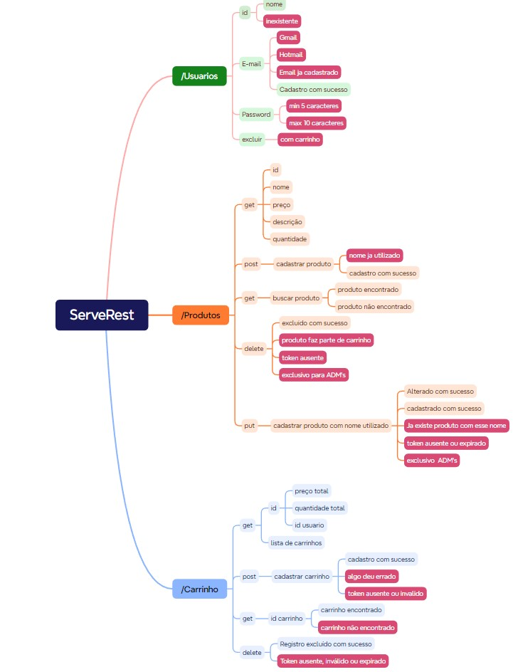

# Dia 7 :: MasterClass Análise HTTP e API REST

## Análise HTTP e API REST

**Aprendizado sobre xmind e serverRest:**

_"A XMind é uma ferramenta para construção de mapas 
mentais em formato de árvores. Nela você pode organizar 
as suas ideias, conectando-as em tópicos, características 
e/ou funcionalidades."_

### Segue abaixo a atividade proposta feita no Xmind:

