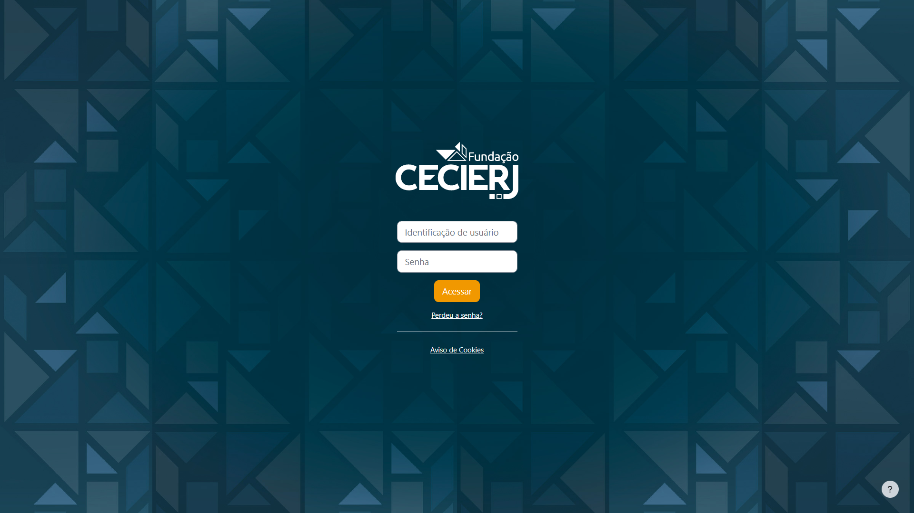

# Dia 6 :: MasterClass Introdução às atividades de análise de teste & Priorização em diferentes aplicações.

## Priorização em diferentes aplicações

- Qual é o real objetivo da minha aplicação?

- Determinar os fluxos prioritarios de testes, são fluxos que não podem deixar de ser executados.

- O fluxo que eu estou abordando, bloqueia ou dificulta a realização do objetivo principal daquela função? Se sim, deve ser priorizado

- Priorização sobre demanda

# Atividade dia 6

**Plataforma de ensino a distancia CEDERJ**

**Lista de prioritários:**

- Login de acesso

- Acesso as vídeo aulas

- verificar servidor com as video aulas

- Acesso as atividades

- Verificar se há erro ao enviar arquivos das atividades