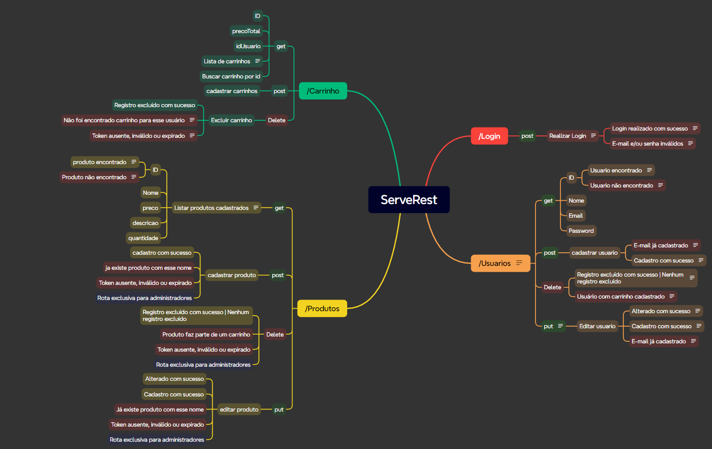

## US 004: [API] Carrinho

Sendo cliente ja  com cadastro em uma  loja, gostaria de selecionar um produto e adiciona-lo ao carrinho
de compras para efutuar o pagamento e finalizar o pedido.

### **DoR**

Banco de dados e infraestrutura para desenvolvimento disponibilizados;
API de cadastro de usuários implementada;
Ambiente de testes disponibilizado.

### **Dod**

Testes cobrindo a rota Carrinhos
Matriz de rastreabilidade atualizada;
Automação de testes baseado na análise realizada;

### **Acceptance Criteria**

* Usuários não autenticados não devem conseguir realizar ações na rota de Carrinhos;
* Não deve ser possível cadastrar apenas 1 carrinho por usuário;
* Ao concluir uma compra o carrinho é excluído
* Não deverá ser feita a exclusão de um carrinho vazio
* Usuários sem token de administrador não deve ser possível alterar carrinho de terceiros
* Ao cancelar uma compra o carrinho é excluído e o estoque dos produtos desse carrinho é reabastecido;

### Mapa mental completo com todas as rotas

**Matriz de Testes para /Carrinhos:**

| Cenário de Teste | Descrição | Dados de Entrada | Ações | Resultado Esperado |  |  |  |
|---|---|---|---|---|---|---|---|
| **TC1:**| Adicionar produto ao carrinho | Usuário autenticado, produto com estoque disponível | Selecionar produto, clicar em "Adicionar ao Carrinho" | Produto adicionado ao carrinho com sucesso | 
| **TC2:**| Tentar adicionar produto ao carrinho sem estar autenticado | Usuário não autenticado, produto com estoque disponível | Selecionar produto, clicar em "Adicionar ao Carrinho" | Mensagem de erro informando a necessidade de autenticação 
| **TC3:**| Tentar adicionar produto ao carrinho com estoque indisponível | Usuário autenticado, produto sem estoque disponível | Selecionar produto, clicar em "Adicionar ao Carrinho" | Mensagem de erro informando a indisponibilidade do produto 
| **TC4:**| Adicionar vários produtos ao carrinho | Usuário autenticado, diversos produtos com estoque disponível | Selecionar diversos produtos, clicar em "Adicionar ao Carrinho" para cada um | Todos os produtos adicionados ao carrinho com sucesso 
| **TC5:**| Tentar cadastrar mais de um carrinho | Usuário autenticado | Tentar cadastrar um novo carrinho após já ter um carrinho existente | Mensagem de erro informando que apenas um carrinho por usuário é permitido 
| **TC6:**| Finalizar compra com carrinho contendo produtos | Usuário autenticado, carrinho com produtos | Iniciar processo de compra, selecionar forma de pagamento e finalizar | Compra finalizada com sucesso, carrinho excluído 
| **TC7:**| Tentar finalizar compra com carrinho vazio | Usuário autenticado, carrinho vazio | Iniciar processo de compra | Mensagem de erro informando que o carrinho está vazio 
| **TC8:**| Cancelar compra com carrinho contendo produtos | Usuário autenticado, carrinho com produtos | Iniciar processo de compra, selecionar forma de pagamento, cancelar compra | Compra cancelada, carrinho excluído e estoque dos produtos reabastecido | 
| **TC9:**| Tentar excluir carrinho vazio | Usuário autenticado, carrinho vazio | Acessar carrinho e clicar em "Excluir Carrinho" | Mensagem de erro informando que o carrinho está vazio 
| **TC10:**| Tentar alterar carrinho de outro usuário sem token de administrador | Usuário autenticado sem token de administrador, ID do carrinho de outro usuário | Acessar rota de alteração de carrinho com ID de outro usuário | Mensagem de erro informando a necessidade de permissão de administrador 
| **TC11:**| Usuário administrador tenta alterar carrinho de outro usuário | Usuário autenticado com token de administrador, ID do carrinho de outro usuário | Acessar rota de alteração de carrinho com ID de outro usuário e modificar itens | Carrinho alterado com sucesso |

**Ambiente de Teste:**

* Sistema operacional: Windows 10
* Navegador web: Google Chrome
* Banco de dados: PostgreSQL

**Ferramentas de Teste:**

* Postman

_Matriz feita com o auxilio do Gemini_